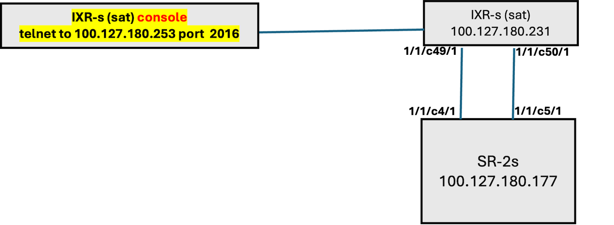

# Agenda

[0. Release information and Topology](#0-release-information-and-topology)

[1. ZTP Satellite provisioning procedure](#1-ztp-satellite-provisioning-procedure)

[2. esat ports Mapping and Configuration in VPRN as SAP](#2-esat-ports-mapping-and-configuration-in-vprn-as-sap)

[3. Logging and Alarms of Satellite and esat ports](#3-logging-and-Alarms-of-satellite)

[4. Qos – Buffer Allocation with various shaping rates](#4-qos--buffer-allocation-with-various-shaping-rates)
   
[5. Qos - Shaping of esat ports](#5-qos--shaping-of-esat-ports)
   
[6. Qos - ACL Egress FC Classification](#6-qos--acl-egress-fc-classification)

[7. Qos - Scheduling Traffic correctly](#7-qos--scheduling-traffic-correctly)
   
   
NOTE: This github does not replace NOKIA official documentation, please see the below NOKIA documentation for more details:
(inset documentation link) 

# 0. Release information and Topology


# 1. ZTP Satellite provisioning procedure 
## Prerequisites
- Compact flash with the ZTP software kit for the 7250 IXR chassis
- The 7250 IXR MAC address printed on the chassis label or from the console during the ZTP autoboot
  (or can be found via console connection with “show chassis” CLI if IXR is loaded, or it can be found     in LOG 99 on 7750 SR host) 

## Procedure
- Insert the compact flash with the ZTP software kit in the 7250 IXR chassis.
- Connect the associated uplinks between the 7750 SR host and the 7250 IXR chassis 
- power on the 7250 IXR chassis.
- Obtain the MAC address from the 7250 IXR.
- Configure a software repository containing the IXR images (the example are on the following slides).
- Configure and enable the satellite on the host
  ```
  configure satellite ethernet-satellite
  ```
- Configure and enable the satellite uplinks (breakout, RS-FEC, and admin status enabled) and establish   the port-topology for the uplink-to-host port.

[For more details, please consult Nokia Documentation](https://documentation.nokia.com/sr/25-10/7x50-shared/basic-system-configuration/system-management.html#basic-system-configurationprovision-ixr-satellite)


Note: for testing ZTP, we will be using a second satellite (see the below diagram) 

Compatibility:
Host SR OS Release 25.x supports 7250 IXR satellite image 23.x, 24.x, and 25.x.
Host SR OS Release 26.x supports 7250 IXR satellite image 24.x, 25.x, and 26.x.





```

 [/configure satellite]
 A:admin@NS2250F5526# info
    ethernet-satellite 2 {
        admin-state enable
        mac-address 8c:f7:73:ed:53:d3
        sat-type es48-sfpp+6-qsfp28
        software-repository "IXR-s-2s 2301 pps. The IXIA 5.10.R7"
        console-access enable
        port-map esat-2/1/1 {
            primary esat-2/1/c49/u1
            secondary esat-2/1/c50/u1
        }
    }
    port-topology 1/1/c4/1 {
        far-end-port-id esat-2/1/c49/u1
    }
    port-topology 1/1/c5/1 {
        far-end-port-id esat-2/1/c50/u1
    }
```
software-repository "IXR-s-25.10.R7" :
```
(pr)[/configure system]
A:admin@NS2250F5526# info
...

software-repository "IXR-s-25.10.R7" {
        primary-location "cf3:\IXR-S-Satellite"
....

```
under cf3:\

```
file list cf3:\IXR-S-Satellite
...
Directory of cf3:\IXR-S-Satellite

01/27/2021  04:14p      <DIR>          ./
01/27/2021  04:14p      <DIR>          ../
08/12/2026  08:51p           508598544 cpm.tim
08/12/2026  08:47p           348007168 iom.tim
08/12/2026  08:47p           185567392 kernel.tim
08/12/2026  08:50p           829771792 support.tim
               4 File(s)             2628955382 bytes.
               2 Dir(s)              2860752896 bytes free.
```


Once ZTP completes
```

A:admin@NS2250F5526# show system satellite eth-sat 2
===============================================================================
Satellite Information
===============================================================================
SatID     Provisioned Type                         Admin         Oper
              Equipped Type (if different)         State         State
-------------------------------------------------------------------------------
esat-2    es48-sfpp+6-qsfp28                       up            up

Description         : (Not Specified)
MAC Address         : 8c:f7:73:ed:53:d3
Software Repository : IXR-s-25.10.R7
SyncE               : Disabled
PTP-TC              : Disabled
PTP-IP              : Disabled
PTP IPv4 address    : 
PTP IPv6 address    : 
Client-Down-Delay   : Disabled
Console Access      : Enabled
Dynamic Uplink      : Disabled
Uplink Distribution : None

Hardware Data
    Platform type                 : N/A
    Part number                   : 3HE13343AARA01
    CLEI code                     : INM4900BRA
    Serial number                 : NS1841C3338
    Manufacture date              : 11082018
    Manufacturing deviations      : (Not Specified)
    Manufacturing assembly number : 
    Administrative state          : up
    Operational state             : up
    Temperature                   : 33C
    Temperature threshold         : 50C
    Over-temperature status       : ok
    Software boot (rom) version   : (Not Specified)
    Software version              : TiMOS-C-25.10.R7 cpm/x86hops64 Nokia 7250
                                    IXR Copyright (c) 2000-2026 Nokia.
                                    All rights reserved. All use subject to
                                    applicable license agreements.
                                    Built on Wed Aug 12 21:00:34 UTC 2026 by
                                    builder in /builds/2510B/R7/panos
    Time of last boot             : 2026/09/06 21:23:45
    Current alarm state           : alarm cleared
    Base MAC address              : 8c:f7:73:ed:53:d3
===============================================================================
```


# 2. esat ports Mapping and Configuration in VPRN as SAP
Once the 7250-IXR-s has been provisioned as a satellite the ports can be viewed and configured as regular 7750-SR ports.
```
show port
sat-1/1/1    Up    Yes  Up      1518 1518    - accs dotq vspeed GIGE-SX
esat-1/1/2    Up    Yes  Up      9208 9208    - hybr dotq vspeed GIGE-SX
esat-1/1/3    Up    Yes  Up      9208 9208    - netw null vspeed GIGE-SX
esat-1/1/4    Up    Yes  Up      9208 9208    - netw null vspeed GIGE-SX

Configure the port as access or hybrid and dot1q encapsulation if required. 
For the esat ports you must set the port to autonegotiate "true" and the speed to 1G.
     info full-context
    /configure port esat-1/1/1 admin-state enable
    /configure port esat-1/1/1 ethernet autonegotiate true
    /configure port esat-1/1/1 ethernet mode access
    /configure port esat-1/1/1 ethernet encap-type dot1q
    /configure port esat-1/1/1 ethernet speed 1000

The esat port can then be configured as a SAP the same way as any other port.

    /configure service vprn "testvprn1" interface "test1" sap esat-1/1/1:10 egress qos latency-budget 100000
    /configure service vprn "testvprn1" interface "test1" sap esat-1/1/1:10 egress qos sap-egress policy-name "BB-scheduler"
    /configure service vprn "testvprn1" interface "test1" sap esat-1/1/1:10 egress qos scheduler-policy policy-name "shaper-access-10m"
    /configure service vprn "testvprn1" interface "test1" sap esat-1/1/1:10 egress filter ip "sat-testing"

```


# 3. Logging and Alarms of Satellite
SNMP
For all the events: name, ID, OID, MIB information: https://documentation.nokia.com/sr/25-10/7x50-shared/log-events/log-satellite.html

State Paths (gNMI SUBSCRIBE / NETCONF get)
path: 
-  /state/log/log-events/satellite[event=*]
-  /state/log/event-trigger/satellite[event=*]

Example of retrieving all events:
```
gnmic -a 100.127.180.177:57400 --insecure -u admin -p Nokia2018! get --path "/state/log/log-events/satellite[event=*]"

```
Output:
```
[
  {
    "source": "100.127.180.177:57400",
    "timestamp": 1788825900854371845,
    "time": "2026-09-07T20:05:00.854371845-04:00",
    "updates": [
      {
        "Path": "state/log/log-events/satellite[event=tmnxSatelliteOperStateChange]",
        "values": {
          "state/log/log-events/satellite": {
            "event": "tmnxSatelliteOperStateChange",
            "event-id": 2001,
            "parameters": [
              "tmnxChassisIndex",
              "tmnxHwIndex",
              "tmnxHwOperState",
              "tmnxSatNotifyFailureReason"
            ],
            "source-stream": "main",
            "statistics": {
              "count": 9,
              "drop": 0
            }
          }
        }
      },
      {
        "Path": "state/log/log-events/satellite[event=tmnxSatSyncIfTimRefSwitch]",
        "values": {
          "state/log/log-events/satellite": {
            "event": "tmnxSatSyncIfTimRefSwitch",
            "event-id": 2002,
            "parameters": [
              "tmnxSatClass",
              "tmnxSatId",
              "tmnxSatSyncIfTimingRef1InUse",
              "tmnxSatSyncIfTimingRef2InUse"
            ],
            "source-stream": "main",
            "statistics": {
              "count": 0,
              "drop": 0
            }
          }
        }
      },
      {
        "Path": "state/log/log-events/satellite[event=tmnxSatSyncIfTimSystemQuality]",
        "values": {
          "state/log/log-events/satellite": {
            "event": "tmnxSatSyncIfTimSystemQuality",
            "event-id": 2003,
            "parameters": [
              "tmnxSatClass",
              "tmnxSatId",
              "tmnxSatSyncIfTimingSystemQltyLvl"
            ],
            "source-stream": "main",
            "statistics": {
              "count": 4,
              "drop": 0
            }
          }
        }
      },
      {
        "Path": "state/log/log-events/satellite[event=tmnxSatSyncIfTimRef1Quality]",
        "values": {
          "state/log/log-events/satellite": {
            "event": "tmnxSatSyncIfTimRef1Quality",
            "event-id": 2004,
            "parameters": [
              "tmnxSatClass",
              "tmnxSatId",
              "tmnxSatSyncIfTimingRef1RxQltyLvl"
            ],
            "source-stream": "main",
            "statistics": {
              "count": 0,
              "drop": 0
            }
          }
        }
      },
      {
        "Path": "state/log/log-events/satellite[event=tmnxSatSyncIfTimRef2Quality]",
        "values": {
          "state/log/log-events/satellite": {
            "event": "tmnxSatSyncIfTimRef2Quality",
            "event-id": 2005,
            "parameters": [
              "tmnxSatClass",
              "tmnxSatId",
              "tmnxSatSyncIfTimingRef2RxQltyLvl"
            ],
            "source-stream": "main",
            "statistics": {
              "count": 0,
              "drop": 0
            }
          }
        }
      },
      {
        "Path": "state/log/log-events/satellite[event=tmnxSatSyncIfTimHoldover]",
        "values": {
          "state/log/log-events/satellite": {
            "event": "tmnxSatSyncIfTimHoldover",
            "event-id": 2006,
            "parameters": [
              "tmnxChassisIndex",
              "tmnxHwIndex",
              "tmnxHwClass"
            ],
            "source-stream": "main",
            "statistics": {
              "count": 0,
              "drop": 0
            }
          }
        }
      },
      {
        "Path": "state/log/log-events/satellite[event=tmnxSatSyncIfTimHoldoverClear]",
        "values": {
          "state/log/log-events/satellite": {
            "event": "tmnxSatSyncIfTimHoldoverClear",
            "event-id": 2007,
            "parameters": [
              "tmnxChassisIndex",
              "tmnxHwIndex",
              "tmnxHwClass"
            ],
            "source-stream": "main",
            "statistics": {
              "count": 0,
              "drop": 0
            }
          }
        }
      },
      {
        "Path": "state/log/log-events/satellite[event=tmnxSatSyncIfTimRef1Alarm]",
        "values": {
          "state/log/log-events/satellite": {
            "event": "tmnxSatSyncIfTimRef1Alarm",
            "event-id": 2008,
            "parameters": [
              "tmnxChassisIndex",
              "tmnxHwIndex",
              "tmnxHwClass",
              "tmnxSatNotifySyncIfTimRefAlarm"
            ],
            "source-stream": "main",
            "statistics": {
              "count": 3,
              "drop": 0
            }
          }
        }
      },
      {
        "Path": "state/log/log-events/satellite[event=tmnxSatSyncIfTimRef1AlarmClear]",
        "values": {
          "state/log/log-events/satellite": {
            "event": "tmnxSatSyncIfTimRef1AlarmClear",
            "event-id": 2009,
            "parameters": [
              "tmnxChassisIndex",
              "tmnxHwIndex",
              "tmnxHwClass",
              "tmnxSatNotifySyncIfTimRefAlarm"
            ],
            "source-stream": "main",
            "statistics": {
              "count": 1,
              "drop": 0
            }
          }
        }
      },
      {
        "Path": "state/log/log-events/satellite[event=tmnxSatSyncIfTimRef2Alarm]",
        "values": {
          "state/log/log-events/satellite": {
            "event": "tmnxSatSyncIfTimRef2Alarm",
            "event-id": 2010,
            "parameters": [
              "tmnxChassisIndex",
              "tmnxHwIndex",
              "tmnxHwClass",
              "tmnxSatNotifySyncIfTimRefAlarm"
            ],
            "source-stream": "main",
            "statistics": {
              "count": 3,
              "drop": 0
            }
          }
        }
      },
      {
        "Path": "state/log/log-events/satellite[event=tmnxSatSyncIfTimRef2AlarmClear]",
        "values": {
          "state/log/log-events/satellite": {
            "event": "tmnxSatSyncIfTimRef2AlarmClear",
            "event-id": 2011,
            "parameters": [
              "tmnxChassisIndex",
              "tmnxHwIndex",
              "tmnxHwClass",
              "tmnxSatNotifySyncIfTimRefAlarm"
            ],
            "source-stream": "main",
            "statistics": {
              "count": 1,
              "drop": 0
            }
          }
        }
      },
      {
        "Path": "state/log/log-events/satellite[event=tmnxSatLocalForwardStateChg]",
        "values": {
          "state/log/log-events/satellite": {
            "event": "tmnxSatLocalForwardStateChg",
            "event-id": 2016,
            "parameters": [
              "tmnxSatLocalForwardId",
              "tmnxSatLocalForwardAdminState",
              "tmnxSatLocalForwardOperState"
            ],
            "source-stream": "main",
            "statistics": {
              "count": 0,
              "drop": 0
            }
          }
        }
      },
      {
        "Path": "state/log/log-events/satellite[event=tmnxSatLocalForwardSapStateChg]",
        "values": {
          "state/log/log-events/satellite": {
            "event": "tmnxSatLocalForwardSapStateChg",
            "event-id": 2017,
            "parameters": [
              "tmnxSatLocalForwardId",
              "tmnxSatPortId",
              "tmnxSatEncapValue",
              "tmnxSatLocalForwardSapAdminState",
              "tmnxSatLocalForwardSapOperState"
            ],
            "source-stream": "main",
            "statistics": {
              "count": 0,
              "drop": 0
            }
          }
        }
      }
    ]
  }
]
```
To filter based on occurrence:
```
gnmic -a 100.127.180.177:57400 --insecure -u admin -p Nokia2018! get --path "/state/log/log-events/satellite[event=*]" --format flat | grep "statistics/count" | grep -v " 0$"
```
Output example:  
```
state/log/log-events/satellite[event=tmnxSatSyncIfTimRef1AlarmClear]/statistics/count: 1
state/log/log-events/satellite[event=tmnxSatSyncIfTimRef1Alarm]/statistics/count: 3
state/log/log-events/satellite[event=tmnxSatSyncIfTimRef2AlarmClear]/statistics/count: 1
state/log/log-events/satellite[event=tmnxSatSyncIfTimRef2Alarm]/statistics/count: 3
state/log/log-events/satellite[event=tmnxSatSyncIfTimSystemQuality]/statistics/count: 4
state/log/log-events/satellite[event=tmnxSatelliteOperStateChange]/statistics/count: 9
```

# 4. Qos – Buffer Allocation with various shaping rates

The 7750-SR-2s with a satellite assigns the buffer allocation based on the sap-egress policy the same as with any MDA. The allocation will be assigned on the "host port" on behalf of the esat port.

**The SAP-Egress configuration of each Queue for CIR/PIR/CBS/and MBS.**


```

The Sap Configuration of TestVPRN1 interface test1 and sap esat-1/1/1

```    
    ipv4 primary address 10.10.10.1
    ipv4 primary prefix-length 24
    sap esat-1/1/1:10 egress qos **latency-budget 100000**
    sap esat-1/1/1:10 egress qos sap-egress policy-name "BB-scheduler"
    sap esat-1/1/1:10 egress qos scheduler-policy policy-name **"shaper-access-10m"**
    sap esat-1/1/1:10 egress filter ip "sat-testing"
```

```
**The formula for latency budget on the sap = Admin MBS x 8= Value, Value/Shaping Rate**

The is the display of Queue 3 buffer allocation.
    Queue : 7000->esat-1/1/1:10->3
```    
= ==============================================================================
FC Map             : af
Dest Slot          : N/A                Dest FP/TAP      : N/A
Queue Type         : best-effort
Admin PIR          : 9631               Oper PIR         : 1200
Admin CIR          : 2889               Oper CIR         : 9
Admin MBS          : 123 KB        Oper MBS         : 123 KB
High-Plus Drop Tail: 123 KB             High Drop Tail   : 123 KB
Low Drop Tail      : 110 KB             Exceed Drop Tail : 98 KB
CBS                : `40 KB`             Depth            : 0
Slope              : not-applicable
Burst Ctrl Grp     : 1/1-40ms (egress)  Visitation Time  : 40ms
Admin Burst Limit  : default            Oper Burst Limit : 6 KB
Admin Burst FIR    : default            Oper Burst FIR   : 0 KB
============================================================================ ===
```

**The above output calculation 123K x 8= 984, 984/10000= 98.4 msec. Queue 3 uses 30% of CBS. 123/40KB= 32%.**

```
    /configure service vprn "testvprn1" interface "test2" ipv4 primary address 10.10.20.1
    /configure service vprn "testvprn1" interface "test2" ipv4 primary prefix-length 24
    /configure service vprn "testvprn1" interface "test2" sap esat-1/1/1:20 egress qos latency-budget 500000
    /configure service vprn "testvprn1" interface "test2" sap esat-1/1/1:20 egress qos sap-egress policy-name "BB-scheduler"
    /configure service vprn "testvprn1" interface "test2" sap esat-1/1/1:20 egress qos scheduler-policy policy-name "shaper-access-100M"
    /configure service vprn "testvprn1" interface "test2" sap esat-1/1/1:20 egress filter ip "sat-testing"
```

 This is the output for test2 interface in testvprn1 for Queue 4.

Queue : 7000->esat-1/1/1:20->4

```
= ==============================================================================
FC Map             : l1
Dest Slot          : N/A                Dest FP/TAP      : N/A
Queue Type         : best-effort
Admin PIR          : 96311              Oper PIR         : 12050
Admin CIR          : 4815               Oper CIR         : 1687
Admin MBS          : 6144 KB            Oper MBS         : 6144 KB
High-Plus Drop Tail: 6144 KB            High Drop Tail   : 6144 KB
Low Drop Tail      : 5504 KB            Exceed Drop Tail : 4864 KB
CBS                : 312 KB             Depth            : 0
Slope              : not-applicable
Burst Ctrl Grp     : 1/1-20ms (egress)  Visitation Time  : 20ms
Admin Burst Limit  : default            Oper Burst Limit : 32 KB
Admin Burst FIR    : default            Oper Burst FIR   : 0 KB
=============================================================================== ==
```

**The above output calculation 6144 x 8= 49,152, 49152/100000= 492 msecs. Queue 4 uses 5% of CBS. 312/6144= 5%.**

# 5. Qos – Shaping of esat ports
 The below are output and calculations from 3 VPRN esat SAP all with different shaping rates.
 
 1) Configuration output from testvprn1 interface test1 sap esat-1/1/1:10.
    ```
    /configure service vprn "testvprn1" interface "test1" ipv4 primary address 10.10.10.1
    /configure service vprn "testvprn1" interface "test1" ipv4 primary prefix-length 24
    /configure service vprn "testvprn1" interface "test1" sap esat-1/1/1:10 egress qos latency-budget 100000
    /configure service vprn "testvprn1" interface "test1" sap esat-1/1/1:10 egress qos sap-egress policy-name "BB-scheduler"
    /configure service vprn "testvprn1" interface "test1" sap esat-1/1/1:10 egress qos scheduler-policy policy-name "shaper-access-10m"
    /configure service vprn "testvprn1" interface "test1" sap esat-1/1/1:10 egress filter ip "sat-testing"
    ```
**Traffic from Ixia is sent at a rate of 13M.**


```
monitor qos scheduler-stats sap "esat-1/1/1:20" egress rate

At time t = 33 sec (Mode: Rate)
- - -----------------------------------------------------------------------------
Egress Schedulers
top                                **2301**                   1200910

- ------------------------------------------------------------------------------
At time t = 44 sec (Mode: Rate)
- - -----------------------------------------------------------------------------
Egress Schedulers
top                                **2299**                   1199943

```

**The above calculation is 2301 pps. The IXIA is sending 522 byte packet plus there is 4 bytes added to each frame from the satellite. 2301 x 546(522 + 20 bytes + 4 bytes) x 8 = 10,050,768.**

 
2) Configuration output from testvprn1 interface test2 sap esat-1/1/1:20.
   ```
   
    /configure service vprn "testvprn1" interface "test2" ipv4 primary address 10.10.20.1
    /configure service vprn "testvprn1" interface "test2" ipv4 primary prefix-length 24
    /configure service vprn "testvprn1" interface "test2" sap esat-1/1/1:20 egress qos latency-budget 500000
    /configure service vprn "testvprn1" interface "test2" sap esat-1/1/1:20 egress qos sap-egress policy-name "BB-scheduler"
    /configure service vprn "testvprn1" interface "test2" sap esat-1/1/1:20 egress qos scheduler-policy policy-name "shaper-access-100M"
    /configure service vprn "testvprn1" interface "test2" sap esat-1/1/1:20 egress filter ip "sat-testing"
   ```
   **Traffic from Ixia is sent at a rate of 105M.**

``` 
 monitor qos scheduler-stats sap "esat-1/1/1:10" egress rate
```
At time t = 33 sec (Mode: Rate)
  -----------------------------------------------------------------------------
Egress Schedulers
top                                **22970**                  11990387

-------------------------------------------------------------------------------
At time t = 44 sec (Mode: Rate)
-- -----------------------------------------------------------------------------
Egress Schedulers
top                                **22969**                  11989723

-- -----------------------------------------------------------------------------
```
```

**The above calculation is 22970 pps. The IXIA is sending 522 byte packet plus there is 4 bytes added to each frame from the satellite. 22970 x 546(522 + 20 bytes + 4 bytes) x 8 = 100,332,960.**
 
3) Configuration output from vprntest2 interface test1 sap esat-1/1/2:30.
```
    /configure service vprn "testvprn2" interface "test1" ipv4 primary address 20.20.20.1
    /configure service vprn "testvprn2" interface "test1" ipv4 primary prefix-length 24
    /configure service vprn "testvprn2" interface "test1" sap esat-1/1/2:30 egress qos latency-budget 500000
    /configure service vprn "testvprn2" interface "test1" sap esat-1/1/2:30 egress qos sap-egress policy-name "BB-scheduler"
    /configure service vprn "testvprn2" interface "test1" sap esat-1/1/2:30 egress qos scheduler-policy policy-name "shaper-access-50m"
    /configure service vprn "testvprn2" interface "test1" sap esat-1/1/2:30 egress filter ip "sat-testing"
```
    
    ** Traffic from Ixia is sent at a rate of 105M.**

```
monitor qos scheduler-stats sap "esat-1/1/2:30" egress rate
```
-- -----------------------------------------------------------------------------
Egress Schedulers
top                                **11498**                  6001766

 -----------------------------------------------------------------------------
At time t = 33 sec (Mode: Rate)
-- -----------------------------------------------------------------------------
Egress Schedulers
top
                                     **11496**                  6001007

                                  
**The above calculation is 11496 pps. The IXIA is sending 522 byte packet plus there is 4 bytes added to each frame from the satellite. 11496 x 546(522 + 20 bytes + 4 bytes) x 8 = 50,223,264.**

end


# 6. Qos – ACL Egress FC Classification

 Egress classification with an egress ip-filter was performed with the following results.
```
ip-filter

A:admin@NS2250F5526# info full-context
    /configure filter ip-filter "sat-testing-30-10" default-action accept
    /configure filter ip-filter "sat-testing-30-10" filter-id 300
    /configure filter ip-filter "sat-testing-30-10" entry 10 match protocol udp
    /configure filter ip-filter "sat-testing-30-10" entry 10 match src-ip address 30.30.30.3
    /configure filter ip-filter "sat-testing-30-10" entry 10 match src-ip mask 255.255.255.255
    /configure filter ip-filter "sat-testing-30-10" entry 10 match dst-port eq 445
    /configure filter ip-filter "sat-testing-30-10" entry 10 action accept
    /configure filter ip-filter "sat-testing-30-10" entry 10 action fc be
    /configure filter ip-filter "sat-testing-30-10" entry 20 match dst-ip ip-prefix-list "10.10.10.4"
    /configure filter ip-filter "sat-testing-30-10" entry 20 action accept
    /configure filter ip-filter "sat-testing-30-10" entry 20 action fc l2
    /configure filter ip-filter "sat-testing-30-10" entry 30 match protocol udp
    /configure filter ip-filter "sat-testing-30-10" entry 30 match src-port range start 1000
    /configure filter ip-filter "sat-testing-30-10" entry 30 match src-port range end 1005
    /configure filter ip-filter "sat-testing-30-10" entry 30 action accept
    /configure filter ip-filter "sat-testing-30-10" entry 30 action fc af
    /configure filter ip-filter "sat-testing-30-10" entry 40 match dscp cs1
    /configure filter ip-filter "sat-testing-30-10" entry 40 action accept
    /configure filter ip-filter "sat-testing-30-10" entry 40 action fc l1
    /configure filter ip-filter "sat-testing-30-10" entry 50 match protocol udp
    /configure filter ip-filter "sat-testing-30-10" entry 50 match src-ip ip-prefix-list "30.30.30.7"
    /configure filter ip-filter "sat-testing-30-10" entry 50 match src-port port-list "BB"
    /configure filter ip-filter "sat-testing-30-10" entry 50 action accept
    /configure filter ip-filter "sat-testing-30-10" entry 50 action fc h2
    /configure filter ip-filter "sat-testing-30-10" entry 60 match dscp af43
    /configure filter ip-filter "sat-testing-30-10" entry 60 action accept
    /configure filter ip-filter "sat-testing-30-10" entry 60 action fc ef
    /configure filter ip-filter "sat-testing-30-10" entry 70 match src-ip address 30.30.30.9
    /configure filter ip-filter "sat-testing-30-10" entry 70 match src-ip mask 255.255.255.255
    /configure filter ip-filter "sat-testing-30-10" entry 70 match dst-ip ip-prefix-list "10.10.10.9"
    /configure filter ip-filter "sat-testing-30-10" entry 70 action accept
    /configure filter ip-filter "sat-testing-30-10" entry 70 action fc h1
    /configure filter ip-filter "sat-testing-30-10" entry 80 match dscp cs5
    /configure filter ip-filter "sat-testing-30-10" entry 80 action accept
    /configure filter ip-filter "sat-testing-30-10" entry 80 action fc nc


   /configure service vprn "testvprn1" interface "test1" sap esat-1/1/1:10 egress filter ip "sat-testing"
   ```


```
show service id 7000 sap "esat-1/1/1:10" stats


Egress Queue 1
For. In/InplusProf    : 0                       0
For. Out/ExcProf      : 692303                  361382166
Dro. In/InplusProf    : 0                       0
Dro. Out/ExcProf      : 526542                  274854924

Egress Queue 2
For. In/InplusProf    : 891385                  465302970
For. Out/ExcProf      : 0                       0
Dro. In/InplusProf    : 327458                  170933076
Dro. Out/ExcProf      : 0                       0

Egress Queue 3
For. In/InplusProf    : 0                       0
For. Out/ExcProf      : 1141212                 595712664
Dro. In/InplusProf    : 0                       0
Dro. Out/ExcProf      : 77629                   40522338

Egress Queue 4
For. In/InplusProf    : 277099                  144645678
For. Out/ExcProf      : 0                       0
Dro. In/InplusProf    : 941741                  491588802
Dro. Out/ExcProf      : 0                       0

Egress Queue 5
For. In/InplusProf    : 487587                  254520414
For. Out/ExcProf      : 0                       0
Dro. In/InplusProf    : 731253                  381714066
Dro. Out/ExcProf      : 0                       0

Egress Queue 6
For. In/InplusProf    : 498703                  260322966
For. Out/ExcProf      : 0                       0
Dro. In/InplusProf    : 720134                  375909948
Dro. Out/ExcProf      : 0                       0

Egress Queue 7
For. In/InplusProf    : 279190                  145737180
For. Out/ExcProf      : 0                       0
Dro. In/InplusProf    : 939647                  490495734
Dro. Out/ExcProf      : 0                       0

Egress Queue 8
For. In/InplusProf    : 452521                  236201888
For. Out/ExcProf      : 0                       0
Dro. In/InplusProf    : 770895                  402407190
```

  


# 7. Qos – Scheduling Traffic correctly
The following test was performed to show that the scheduler is working correctly with satellite ports.


**CIR amounts for all queues equal 100%. If each queue is receiving 10M the cir-level should all be consumed with no traffic left for above-cir**


 With 80M of traffic we can see that cir-level is being consumed correct with the scheduler.
 


