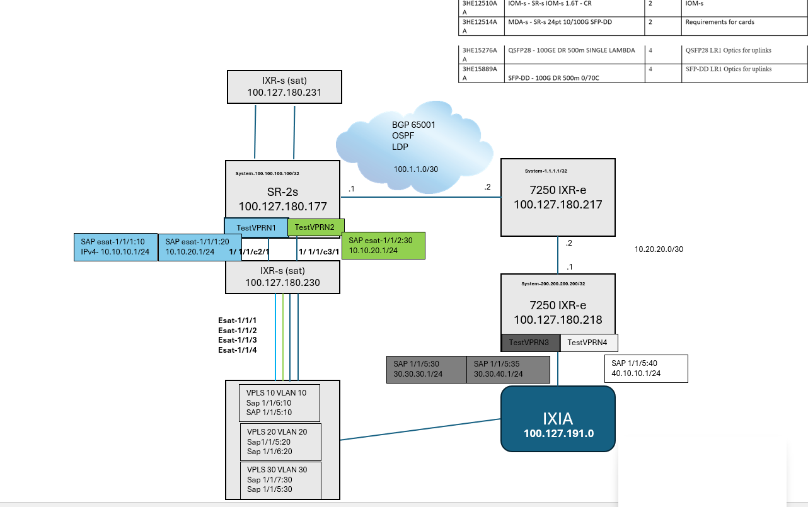

# Agenda

[0. Release information and Topology](#0-release-information-and-topology)

[1. ZTP Satellite provisioning procedure](#1-ztp-satellite-provisioning-procedure)

2. esat ports in VPRN as SAP.
3. Logging and Alarms of Satellite and esat ports
4. Qos – Buffer Allocation with various shaping rates
5. Qos - Shaping of esat ports
6. Qos - ACL Egress FC Classification.
7. Qos - Scheduling Traffic correctly
   

# 0. Release information and Topology




# 1. ZTP Satellite provisioning procedure 
## Prerequisites
- Compact flash with the ZTP software kit for the 7250 IXR chassis
- The 7250 IXR MAC address printed on the chassis label or from the console during the ZTP autoboot
  (or can be found via console connection with “show chassis” CLI if IXR is loaded, or it can be found     in LOG 99 on 7750 SR host) 

## Procedure
- Insert the compact flash with the ZTP software kit in the 7250 IXR chassis.
- Connect the associated uplinks between the 7750 SR host and the 7250 IXR chassis 
- power on the 7250 IXR chassis.
- Obtain the MAC address from the 7250 IXR.
- Configure a software repository containing the IXR images (the example are on the following slides).
- Configure and enable the satellite on the host
  ```
  configure satellite ethernet-satellite
  ```
- Configure and enable the satellite uplinks (breakout, RS-FEC, and admin status enabled) and establish   the port-topology for the uplink-to-host port.

Note: for testing ZTP, we will be using second satellite (see below diagram) 


```

 [/configure satellite]
 A:admin@NS2250F5526# info
    ethernet-satellite 2 {
        admin-state enable
        mac-address 8c:f7:73:ed:53:d3
        sat-type es48-sfpp+6-qsfp28
        software-repository "IXR-s-25.10.R7"
        console-access enable
        port-map esat-2/1/1 {
            primary esat-2/1/c49/u1
            secondary esat-2/1/c50/u1
        }
    }
    port-topology 1/1/c4/1 {
        far-end-port-id esat-2/1/c49/u1
    }
    port-topology 1/1/c5/1 {
        far-end-port-id esat-2/1/c50/u1
    }
```
software-repository "IXR-s-25.10.R7" :
```
(pr)[/configure system]
A:admin@NS2250F5526# info
...

software-repository "IXR-s-25.10.R7" {
        primary-location "cf3:\IXR-S-Satellite"
....

```
under cf3:\

```
file list cf3:\IXR-S-Satellite
...
Directory of cf3:\IXR-S-Satellite

01/27/2021  04:14p      <DIR>          ./
01/27/2021  04:14p      <DIR>          ../
08/12/2026  08:51p           508598544 cpm.tim
08/12/2026  08:47p           348007168 iom.tim
08/12/2026  08:47p           185567392 kernel.tim
08/12/2026  08:50p           829771792 support.tim
               4 File(s)             2628955382 bytes.
               2 Dir(s)              2860752896 bytes free.
```


Once ZTP completes
```

A:admin@NS2250F5526# show system satellite eth-sat 2
===============================================================================
Satellite Information
===============================================================================
SatID     Provisioned Type                         Admin         Oper
              Equipped Type (if different)         State         State
-------------------------------------------------------------------------------
esat-2    es48-sfpp+6-qsfp28                       up            up

Description         : (Not Specified)
MAC Address         : 8c:f7:73:ed:53:d3
Software Repository : IXR-s-25.10.R7
SyncE               : Disabled
PTP-TC              : Disabled
PTP-IP              : Disabled
PTP IPv4 address    : 
PTP IPv6 address    : 
Client-Down-Delay   : Disabled
Console Access      : Enabled
Dynamic Uplink      : Disabled
Uplink Distribution : None

Hardware Data
    Platform type                 : N/A
    Part number                   : 3HE13343AARA01
    CLEI code                     : INM4900BRA
    Serial number                 : NS1841C3338
    Manufacture date              : 11082018
    Manufacturing deviations      : (Not Specified)
    Manufacturing assembly number : 
    Administrative state          : up
    Operational state             : up
    Temperature                   : 33C
    Temperature threshold         : 50C
    Over-temperature status       : ok
    Software boot (rom) version   : (Not Specified)
    Software version              : TiMOS-C-25.10.R7 cpm/x86hops64 Nokia 7250
                                    IXR Copyright (c) 2000-2026 Nokia.
                                    All rights reserved. All use subject to
                                    applicable license agreements.
                                    Built on Wed Aug 12 21:00:34 UTC 2026 by
                                    builder in /builds/2510B/R7/panos
    Time of last boot             : 2026/09/06 21:23:45
    Current alarm state           : alarm cleared
    Base MAC address              : 8c:f7:73:ed:53:d3
===============================================================================
```
# 2. esat ports in VPRN as SAP

# 3. Logging and Alarms of Satellite and esat ports

# 4. Qos – Buffer Allocation with various shaping rates

# 5. Qos - Shaping of esat ports

# 6. Qos - ACL Egress FC Classification

# 7. Qos - Scheduling Traffic correctly


